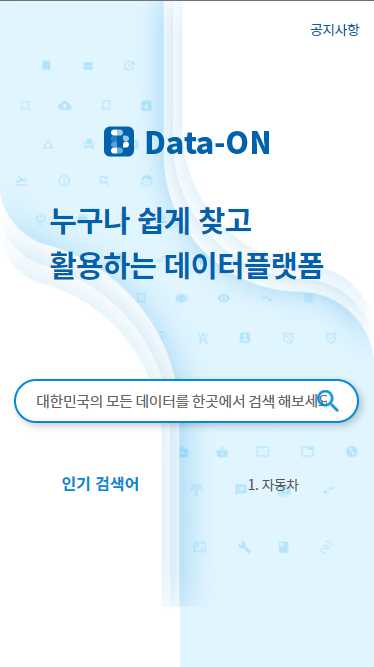
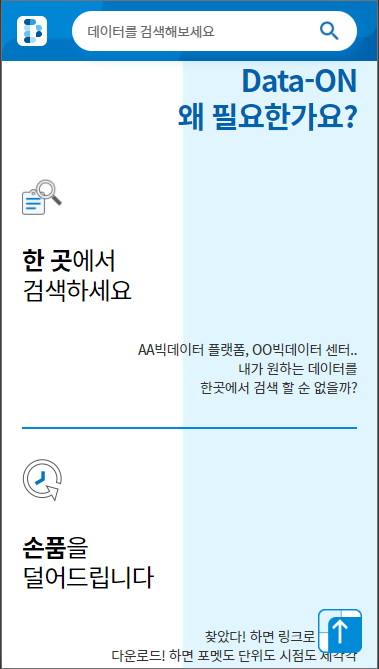
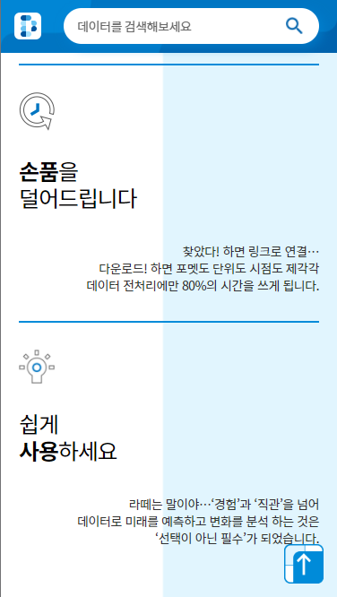
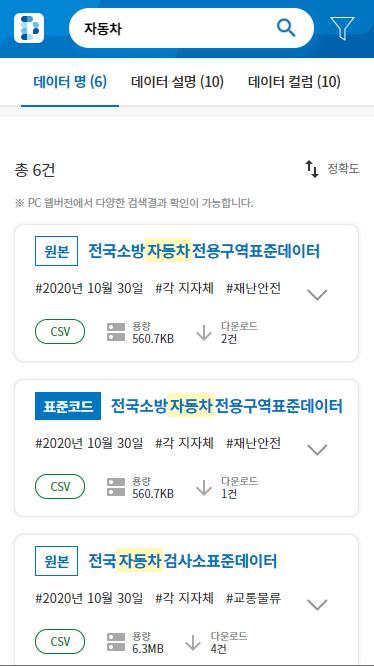
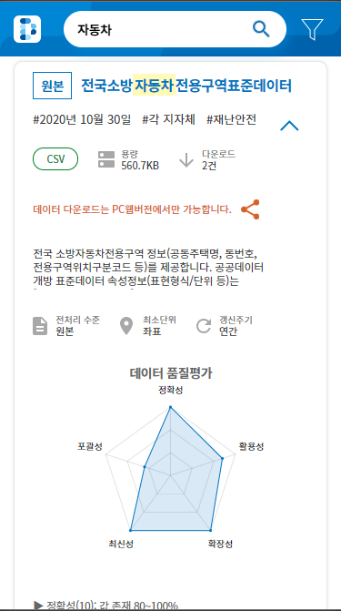
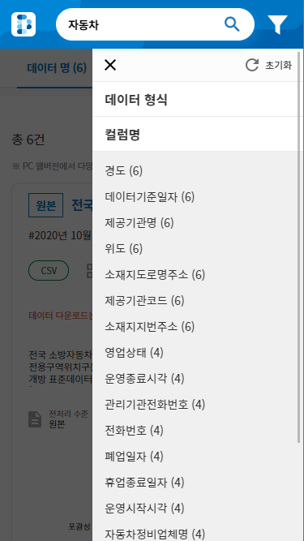

# <a href="https://data-on.co.kr" target="_blank">Data-ON</a>

## 프로젝트 시작하게 된 동기

### 이번 프로젝트도 B to C 기반으로 기획했다. 공공데이터 기반으로 서비스를 제공해야 겠다고 생각했으며, 주 타켓팅은 공공데이터 포털을 사용하는 유저를 타켓팅하여 누구나 쉽게 찾고 활용할 수 있는 데이터플랫폼 만들었다. 앞으로 더 개선해 나가야할 점이 많다.

<br/><br/>

## 시스템 구성환경

### 시스템 구성환경은 아래와 같다. 기존 공공기관을 타켓팅하는 서비스보다는 언어의 제한이 줄어들었다. 기본적으로 기존에는 IE9까지 지원해야 했지만, 현재 이 서비스는 IE11, Chrome, Safari, Firefox, Opera, Wale, Edge까지 지원하는 것을 목표로 삼았다. 그래서 우리는 현재 인기가 급부상하고 있고, 러닝커브가 낮은 NuxtJS 프레임워크를 채택하기로 하였다. 또한, ES6이상 Javscript / HTML5 / CSS3를 사용하여 개발을 진행하였다.

<br/><br/>

|    유형    |                           스택                           | 참여(율) |
| :--------: | :------------------------------------------------------: | :------: |
| `Frontend` | VueJS, HTML5, javascript(es6), css3(Media-Query), NuxtJS |  O(50%)  |
| `Backend`  |                          dJango                          |    X     |
| `Database` |                        postgreSQL                        |    X     |
|  `Infra`   |        Iaas(iwinV, Docker, Reverse proxy server)         | O(100%)  |
| `Library`  |      jQuery, d3, lodash, carousel, google analytics      |          |

<br/><br/>

## 프로세스 흐름도

### 무중단 수동배포도 포함되어 있으므로 매우 복잡하다...

<br/>

**[이미지 삽입예정!!!]**

<br/><br/>

## 기능

1. 빅데이터 & 인공지능으로 진단하고 처방하는 도시분석 서비스

2. 공공데이터기반

3. 부가서비스 지원(코로나현황 + 4.15 3.

4. 모바일 지원

<br/><br/>

## 실제 화면

<br/>

### <p align="center">**WEB**</p>


<br/>

### <p align="center">**MOBILE**</p>

<p align="center"></p>
<p align="center"></p>
<p align="center"></p>
<p align="center"></p>
<p align="center"></p>
<p align="center"></p>

<br/><br/>

## 이슈사항

- 운영 / 개발 CI & CD
- 오토스케일
- 로드밸런싱
- 데이터베이스 동기화

<br/><br/>

## 개선사항

<br/><br/>

## 환경세팅

```bash
git clone https://github.com/Hulkong/Data-ON.git
cd ./Data-On

# 로컬 개발시 사용한 node, npm 버전
# node 12.13.1, npm 6.12.1

# install dependencies
$ npm install

# serve with hot reload at localhost:3000
$ npm run dev

# build for production and launch server
$ npm run build
$ npm run start

# generate static project
$ npm run generate
```

For detailed explanation on how things work, check out [Nuxt.js docs](https://nuxtjs.org).
